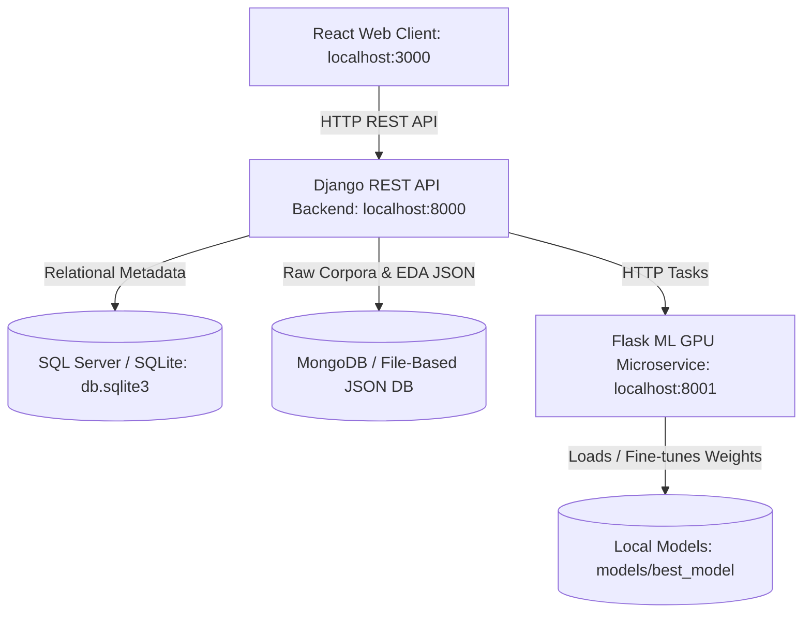

# 🌐 English-to-Arabic Machine Translator — Senior PM Project Specification & Technical Guide

---

## 1. Executive Summary & Project Overview

### What the Project Does
The **English-to-Arabic Machine Translator** is a full-stack, enterprise-grade machine learning platform designed to curate English-Arabic parallel text corpora, execute a 6-stage automated exploratory data analysis (EDA) and data cleaning pipeline, fine-tune sequence-to-sequence Neural Machine Translation (NMT) models, evaluate translation quality with standard metrics (BLEU, chrF, TER), and serve real-time translations via an interactive React web dashboard.

### Core Business & Technical Use Cases
1. **Automated Parallel Corpus Quality Control**: Ingest raw parallel datasets (CSV, TSV, JSON, HuggingFace OPUS books), automatically flag bad encodings, remove duplicate sentence pairs, filter length outliers, and compute a 0–100% **Dataset Health Score**.
2. **GPU-Optimized NMT Fine-Tuning**: Fine-tune domain-adapted Transformer models using mixed-precision (FP16), gradient accumulation, weight decay, and early stopping on consumer or cloud GPUs (e.g., 6GB VRAM bounds).
3. **Automated Translation Quality Benchmarking**: Quantitatively compare fine-tuned models against base models using sacreBLEU, character-level chrF, and Translation Edit Rate (TER).
4. **Offline & Real-Time NMT Serving**: Translate single sentences or batch documents locally without external cloud API dependencies.

---

## 2. System Architecture & Dual-Database Design

The platform uses a decoupled microservices architecture with a dual-database pattern:



### Component Breakdown:
- **React Frontend (`port 3000`)**: Interactive UI for dataset upload, step-by-step EDA visualization, training configuration, live learning curve charting, BLEU evaluation summaries, and real-time translation testing.
- **Django Backend (`port 8000`)**: RESTful API orchestration layer handling authentication, business logic, asynchronous task dispatching, and relational database management.
- **Flask ML Microservice (`port 8001`)**: Dedicated PyTorch execution engine running MarianMT inference and training tasks on GPU/CPU.

### Dual-Database Design Pattern:
1. **Relational Database (SQL Server / SQLite)**: Stores structured operational metadata:
   - `Dataset`: Upload status, file paths, total pair counts, collection keys.
   - `PreprocessingRun`: Data cleaning statistics, duplicate percentages, missing row counts, outlier ratios.
   - `TrainingJob`: Hyperparameter configs, training status, loss curves, validation BLEU scores, diagnosis.
   - `EvaluationResult`: Automated BLEU, chrF, and TER scores comparing base vs. fine-tuned checkpoints.
   - `TranslationLog`: Audit logs of real-time translation requests and execution latencies.

2. **Unstructured Storage (MongoDB / File-Based JSON Fallback)**: Stores large corpus collections and reports:
   - `dataset_<name>_raw`: High-volume JSON array of parallel `{"en": "...", "ar": "..."}` sentence pairs.
   - `dataset_<name>_cleaned`: Cleaned, deduplicated, and filtered sentence pair records ready for PyTorch tokenization.
   - `eda_reports`: Statistical length distributions, character ratios, and token histograms.
   - `experiment_logs`: Epoch-by-epoch training metrics (`train_loss`, `val_loss`, `val_bleu`).

---

## 3. Deep-Dive on Machine Learning Model & Fine-Tuning

### Model Architecture: MarianMT (`Helsinki-NLP/opus-mt-en-ar`)
- **Base Architecture**: Sequence-to-Sequence (Seq2Seq) Transformer based on the Marian C++ Neural Machine Translation framework.
- **Parameters & Checkpoint Size**: ~77 million parameters with a lightweight ~300 MB disk weight footprint (`model.safetensors`).
- **Encoder-Decoder Layers**: 6 Encoder layers and 6 Decoder layers with multi-head self-attention and cross-attention mechanisms.
- **Tokenization Engine**: SentencePiece Byte-Pair Encoding (BPE) vocabulary containing 62,802 tokens.
  - Special tokens: `<pad>` (id 62801), `</s>` (id 0), `<unk>` (id 1).

### Optimization & Hyperparameter Strategy
- **Mixed Precision Training**: Uses `torch.cuda.amp.autocast(dtype=torch.float16)` to reduce VRAM memory consumption by 50% and accelerate GPU matrix multiplications.
- **Gradient Accumulation**: Simulated effective batch size of 32 (Per-device `batch_size = 4` × `gradient_accumulation_steps = 8`), allowing deep fine-tuning on GPUs with 6GB VRAM.
- **Optimizer**: AdamW with weight decay (`0.01`) and learning rate (`5e-5`).
- **Early Stopping**: Monitors validation loss and validation BLEU with patience (`3` epochs) to prevent overfitting.

### Automated Evaluation Metrics
1. **BLEU (Bilingual Evaluation Understudy)**: Measures n-gram precision (1-gram to 4-gram) against target references with a brevity penalty. (Target BLEU ≥ 25.0).
2. **chrF (Character n-gram F-score)**: Evaluates character-level precision and recall, essential for Arabic due to its rich morphological variations and prefixes.
3. **TER (Translation Edit Rate)**: Measures the minimum number of edits (insertions, deletions, substitutions, shifts) required to transform translated text into the reference text (lower is better).

---

## 4. Complete 8-Step ML Pipeline & Codebase Function Index

### 🔹 Module 1: Data Exploration (`backend/ml/data_loader.py`)
- `load_dataset(file_obj, file_type, en_column, ar_column)`: Ingests CSV, TSV, or JSON files with fallback encodings (`utf-8-sig`, `latin1`, `cp1256`) and normalizes column headers to `en` and `ar`.
- `explore_dataset(df)`: Computes statistical metrics (min/max/avg character lengths, token statistics, unique percentages, duplicate ratios, memory footprint, EN/AR ratios, 50 preview pairs) and calculates the **Dataset Health Score (0–100%)**.
- `detect_encoding_issues(text)`: Scans strings for mojibake encoding corruption patterns.
- `is_arabic(text)`: Verifies if a string contains valid Unicode Arabic script (`\u0600-\u06FF`).
- `is_english(text)`: Verifies if a string contains valid ASCII English alphabetic characters.

### 🔹 Module 2: Deduplication (`backend/ml/duplicates.py`)
- `detect_duplicates(df)`: Scans dataset for exact duplicate sentence pairs, `en`-only duplicates, and `ar`-only duplicates.
- `remove_duplicates(df, strategy, keep)`: Removes duplicate rows based on selected strategy (`full_pair`, `en_only`, or `ar_only`).
- `handle_duplicates(df)`: Complete execution pipeline combining detection and conservative deduplication.

### 🔹 Module 3: Missing Value Handling (`backend/ml/missing_values.py`)
- `detect_missing_values(df)`: Identifies `NaN`, `None`, empty strings, and whitespace-only strings per column.
- `handle_missing_values(df, strategy)`: Safely drops incomplete translation pairs (never imputes text).

###  accumulation & Outlier Filtering (`backend/ml/outliers.py`)
- `compute_length_features(df)`: Calculates token counts, character counts, and EN-to-AR length ratios.
- `detect_outliers_zscore(df, column, threshold)`: Flags length anomalies using Z-score boundaries (> 3.0 std dev).
- `detect_outliers_iqr(df, column, factor)`: Flags anomalies using Interquartile Range (IQR multiplier 1.5).
- `handle_outliers(df, method, length_ratio_min, length_ratio_max)`: Drops extreme length outliers and abnormal length ratios.

### 🔹 Module 5: Data Visualizations (`backend/ml/visualizations.py`)
- `generate_all_charts(df, output_dir)`: Generates 7+ PNG charts (Token histograms, Character length KDE, EN vs AR scatter plot, Length ratio boxplots, Token correlation heatmap, Imbalance bar charts).

### 🔹 Module 6: Imbalance Handling (`backend/ml/imbalance.py`)
- `categorize_length(tokens)`: Maps sentence token counts into 5 length buckets (`very_short`, `short`, `medium`, `long`, `very_long`).
- `handle_imbalance(df, strategy)`: Analyzes sequence length distribution and applies optional random under/oversampling.

### 🔹 Module 7: Model Fine-Tuning (`backend/ml/trainer.py`)
- `TranslationDataset(TorchDataset)`: Custom PyTorch dataset class that tokenizes English and Arabic text pairs and formats target labels with `-100` padding masks.
- `split_dataset(df, train_ratio, val_ratio, test_ratio)`: Splits corpus into train, validation, and test subsets.
- `compute_bleu_score(predictions, references)`: Computes corpus BLEU score via `sacrebleu`.
- `train_model(df, model_name, save_dir, ...)`: Executes the PyTorch fine-tuning loop with FP16 autocasting, gradient accumulation, early stopping, checkpoint saving, and learning curve chart generation.

### 🔹 Module 8: Evaluation & Benchmarking (`backend/ml/evaluator.py`)
- `evaluate_model(test_df, model_path, baseline_model_name, ...)`: Runs automated test set evaluation, generating side-by-side BLEU, chrF, and TER scores comparing base model vs. fine-tuned checkpoint.

### 🔹 Module 9: Inference & Real-Time Translation (`backend/ml/inference.py`)
- `load_model(model_path, model_name)`: Loads HuggingFace MarianMT model and tokenizer into GPU/RAM memory with global caching to prevent redundant disk loads.
- `translate(text, model_path, max_length, num_beams)`: Translates a single English sentence to Arabic with beam search.
- `translate_batch(texts, model_path, batch_size)`: Performs high-throughput batch translation for arrays of sentences.

### 🔹 Module 10: Storage Fallback Engine (`backend/mongodb_client.py`)
- `MongoDBClient`: Unified interface providing zero-config local JSON file storage (`FileBasedDB` under `local_mongo_data/`) when MongoDB server is not running, ensuring 100% offline availability.

---

## 5. User Journey & Step-by-Step Operations

1. **Step 1 — Upload Dataset (`Upload.jsx`)**: Drop a CSV/TSV/JSON file or download 10,000 OPUS Books sentence pairs. Instantly view dataset health score, database footprint, length statistics, and 50 preview translation pairs.
2. **Step 2 — Run Preprocessing (`Preprocess.jsx`)**: Execute automated deduplication, missing value removal, and outlier filtering.
3. **Step 3 — View EDA & Visualizations (`EDA.jsx`)**: Inspect token distributions, length ratios, and scatter charts.
4. **Step 4 — Configure & Start Fine-Tuning (`Training.jsx`)**: Set batch size, epochs, and learning rate. Monitor live training loss and validation BLEU curves.
5. **Step 5 — Evaluate Model (`Evaluation.jsx`)**: Benchmark fine-tuned checkpoint against baseline model across BLEU, chrF, and TER metrics.
6. **Step 6 — Real-Time Translation (`Translate.jsx`)**: Test English-to-Arabic translation using local models with beam search options.

---

## 6. How to Run Locally

```bash
# 1. Activate Environment & Run Setup Script
start_local.bat

# Manual Setup Alternative:
pip install -r backend/requirements.txt
pip install -r ml_worker/requirements.txt
cd frontend && npm install

# Run Backend
python backend/manage.py migrate
python backend/manage.py runserver 0.0.0.0:8000

# Run ML Worker
python ml_worker/worker.py

# Run Frontend
cd frontend && npm start
```
