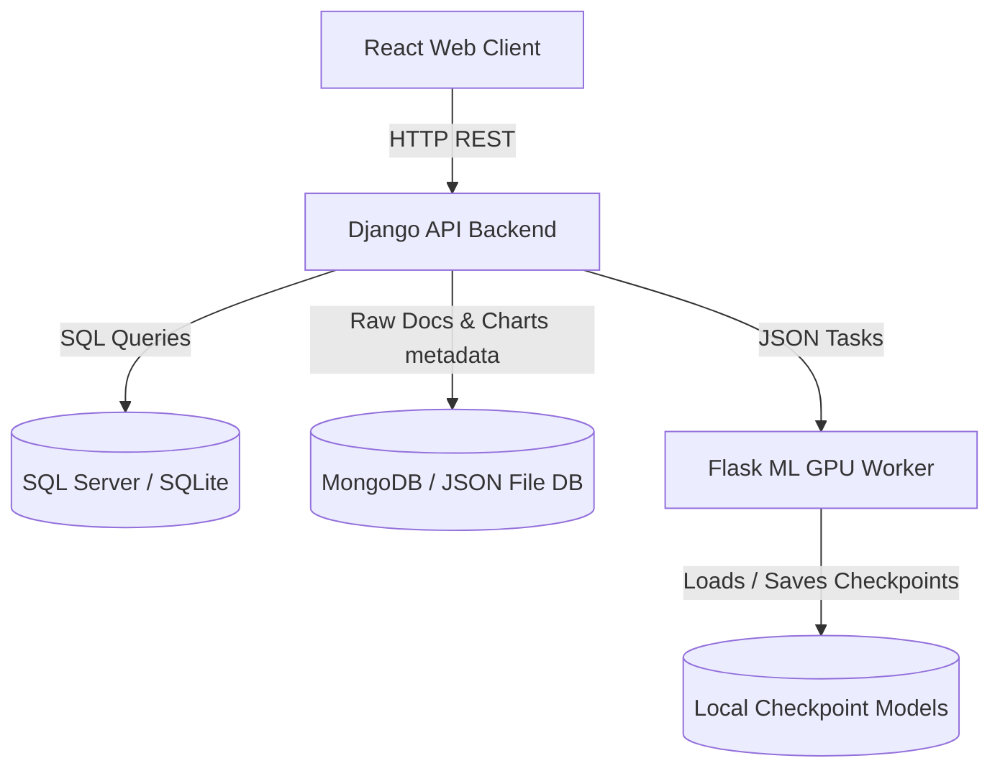

# English-to-Arabic Machine Translator — Project Documentation

This document provides a comprehensive overview of the **English-to-Arabic Machine Translator** project, outlining its system architecture, dual-database design, the 8-step machine learning engineering pipeline, API schemas, and local setup.

---

## 1. Project Overview & Features

The Machine Translator is a complete web application designed to load English-to-Arabic parallel corpora, run a 6-stage exploratory and data cleaning pipeline, fine-tune a seq2seq transformer model (based on MarianMT), evaluate the results using standard metrics (BLEU, chrF, TER), and log translation queries.

### Key Features:
- **Interactive UI**: Upload datasets, monitor preprocessing step-by-step, view data visualization charts, start background GPU training, view evaluations, and run real-time translation queries.
- **Robust Preprocessing Pipeline**: Built-in handlers to filter duplicate sentence pairs, safely delete missing values, detect length outliers via IQR/Z-score, check class/length imbalances, and produce 7+ EDA charts.
- **Resource-Aware Fine-Tuning**: Custom PyTorch training script featuring mixed precision (fp16), gradient accumulation to fit within 6GB VRAM bounds, and early stopping.
- **Dual-Database Storage**: Integrates a relational SQL database for structured tables (Datasets, Jobs, Evaluation logs) and MongoDB (or local JSON fallback) for raw corpora, EDA reports, and detailed experiment history logs.

---

## 2. System Architecture

The application is structured into three main layers:
1. **Frontend (React)**: Interactive dashboard built with React and styled with a custom CSS template, using Axios for REST requests.
2. **Backend (Django REST Framework)**: Manages metadata, dispatches background threads, queries MongoDB client, and manages SQL server relations.
3. **ML Worker (Flask)**: A separate microservice that runs GPU-accelerated model training and text inference (translations).



---

## 3. Dual-Database Design

To optimize storage performance, the backend separates operational data from large unstructured dataset texts:

### Relational Database Schema (SQL Server / SQLite)
- **`datasets`**: Tracks dataset upload status, name, sizes, and collection keys.
- **`preprocessing_runs`**: Logs statistics for each preprocessing attempt (original size, clean size, deduplication count, missing value counts, outlier percentages, chart paths, imbalance categories).
- **`training_jobs`**: Tracks config params, active thread state, splits, validation loss, BLEU score, diagnosis, and path checkpoints.
- **`evaluation_results`**: Compares baseline pretrained model scores against fine-tuned checkpoints across BLEU, chrF, and TER metrics, including qualitative sentence examples.
- **`translation_logs`**: Tracks real-time translations for usage logs.

### Unstructured Database Schema (MongoDB / JSON Fallback)
- **`dataset_<name>_raw`**: Stores raw `{"en": "...", "ar": "..."}` documents.
- **`dataset_<name>_raw_cleaned`**: Stores preprocessed sentence pairs.
- **`eda_reports`**: Holds detailed EDA summaries and token length properties.
- **`experiment_logs`**: Stores epoch-by-epoch training logs (`train_loss`, `val_loss`, `val_bleu`).

---

## 4. The 8-Step ML Pipeline

The application enforces an 8-stage pipeline to guarantee high-quality dataset curation and model fine-tuning:

1. **Load & Explore**: Read parallel files and detect encoding types or language ratios (e.g., verify English character presence in the `en` column).
2. **Deduplicate**: Detect and remove exact duplicates on full pairs, `en`-only text (same source, different translations), or `ar`-only text (different source, same translation).
3. **Handle Missing Values**: Replace empty space strings with `NaN` and drop incomplete rows. Imputation is not used for sequence translations.
4. **Detect Outliers**: Measure token/character length and length ratios. Filter outliers using IQR (Interquartile Range) and Z-score boundaries.
5. **Generate Visualizations**: Plot 7+ distinct charts (Histograms, KDE plots, Scatter plots with trendlines, Boxplots, Correlation heatmaps, and Category bar charts) to identify data issues.
6. **Handle Imbalance**: Categorize sentence lengths into synthetic categories (`very_short`, `short`, `medium`, `long`, `very_long`) and analyze distribution. Supports random under/oversampling.
7. **Train Model**: Fine-tune the sequence-to-sequence model using early stopping, weight decay, mixed precision, and gradient accumulation.
8. **Evaluate Results**: Run comparison metrics against the baseline, check if exit criteria are met (target BLEU ≥ 25.0), and generate recommendations.

---

## 5. API Endpoints

### Dataset Management
- **`GET /api/dataset/`**: List all uploaded datasets.
- **`GET /api/dataset/<id>/`**: Get details of a single dataset.
- **`POST /api/dataset/upload/`**: Upload a dataset file (accepts `file`, `name`, `description`, `en_column`, `ar_column`).
- **`POST /api/dataset/download-sample/`**: Trigger sample download from HuggingFace (OPUS-100).

### Preprocessing & EDA
- **`POST /api/preprocess/run/`**: Trigger the preprocessing pipeline (`{"dataset_id": <id>}`).
- **`GET /api/preprocess/<id>/`**: Get preprocessing details.
- **`GET /api/preprocess/list/<dataset_id>/`**: List runs for a dataset.
- **`GET /api/eda/report/<dataset_id>/`**: Get full EDA summary report.
- **`GET /api/eda/chart/<filename>`**: Stream a generated chart PNG.
- **`GET /api/eda/charts/`**: List all chart filenames.

### Model Training & Evaluation
- **`POST /api/train/start/`**: Start background training job.
- **`GET /api/train/status/<job_id>/`**: Poll progress and epoch status.
- **`GET /api/train/list/`**: List training jobs.
- **`POST /api/evaluate/run/<job_id>/`**: Run BLEU metric evaluation.
- **`GET /api/evaluate/<job_id>/`**: Retrieve evaluation results.

### Translation Client
- **`POST /api/translate/`**: Real-time single sentence translator (`{"text": "...", "model_path": "..."}`).
- **`POST /api/translate/batch/`**: Translate lists of sentences.
- **`GET /api/translate/history/`**: Get recent logs.

---

## 6. How to Run Locally

1. **Environment Setup**:
   Create a virtual environment and install backend requirements:
   ```bash
   pip install -r backend/requirements.txt
   pip install -r ml_worker/requirements.txt
   ```
2. **Setup Configurations**:
   Create a `.env` file in the root directory:
   ```env
   USE_SQLITE=True
   MONGO_FALLBACK=file
   DJANGO_DEBUG=True
   MODEL_NAME=Helsinki-NLP/opus-mt-en-ar
   ```
3. **Database Migration**:
   ```bash
   python backend/manage.py migrate
   ```
4. **Download Base Model & Sample Data**:
   ```bash
   python download_model.py
   python download_dataset.py
   ```
5. **Run Applications**:
   - Start Django Backend: `python backend/manage.py runserver`
   - Start ML Worker: `python ml_worker/worker.py`
   - Start React Frontend: `cd frontend && npm start`
