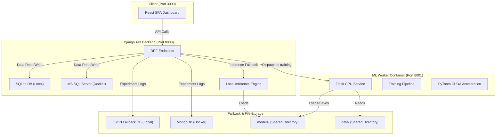

# 🌐 English-to-Arabic Neural Machine Translator (NMT)

An end-to-end, full-stack machine translation system combining **data engineering**, **exploratory data analysis (EDA)**, **sequence-to-sequence fine-tuning**, and an **interactive React dashboard** for translating English text to Arabic. 

The system leverages **PyTorch**, **Hugging Face Transformers (Marian MT)**, and **GPU acceleration** (CUDA) to deliver high-performance training and real-time inference.

---

## 🚀 Key Features

* **Dual Running Modes**:
  * 💻 **Local Mode (Lightweight)**: Runs natively on Windows using **SQLite** and a **JSON-file database fallback** for quick development without database installations.
  * 🐳 **Docker Mode (Enterprise)**: Runs containerized with **MS SQL Server** (structured tracking) and **MongoDB** (experiment logging and EDA reports).
* **GPU Acceleration (CUDA)**: Automatic detection of NVIDIA GPUs for **20x to 50x faster** training and sub-second translation latencies.
* **Complete 8-Step ML Pipeline**: Integrated data preprocessing, duplicate removal, outlier filtering, exploratory plotting, model training, and BLEU/chrF/TER evaluation.
* **Modern Web Interface**: Responsive React dashboard featuring real-time translation, bulk CSV dataset translation, EDA charts, and live training progress monitoring.

---

## 🏗️ Architecture & Service Layout



### Port Mappings
| Service | Technology | Local Port | Role |
|---------|-----------|------------|------|
| **Frontend** | React 18 + Axios | `3000` | User dashboard, dataset management, translation UI |
| **Backend API** | Django 4.2 + DRF | `8000` | Database operations, dataset preprocessing, experiment listing |
| **ML Worker** | Flask + PyTorch | `8001` | GPU-bound training jobs and translation inference server |
| **MongoDB** | MongoDB 7.0 | `27017` | Unstructured storage for EDA reports & experiment logs |
| **SQL Server** | MS SQL Server 2022 | `1433` | Structured storage for datasets, runs, and job records |

---

## ⚙️ Tech Stack & Dependencies

* **Frontend**: React 18, Axios, React Dropzone, ChartJS / HTML widgets.
* **Backend**: Django 4.2, Django REST Framework, MongoDB client (`pymongo`), SQL Server client (`mssql-django`, `pyodbc`).
* **Deep Learning & NLP**: PyTorch (CUDA 12.4), Hugging Face `transformers` (Marian Seq2Seq), `sacrebleu` (BLEU & chrF evaluation), `sentencepiece` (Marian tokenizer).
* **Data Processing & Analytics**: Pandas, NumPy, Scikit-learn, Imbalanced-learn, Matplotlib, Seaborn.

---

## 🛠️ Part 1: Running the Application Stack

### Option A: Local Development Mode (Recommended & Easiest)
Local mode runs the entire stack natively on Windows without requiring Docker, MS SQL Server, or MongoDB.

#### 1. Prerequisites
* **Python 3.11 or 3.12** installed and added to your system `PATH`.
* **Node.js 18+** installed.
* **NVIDIA GPU (Optional)**: If `nvidia-smi` is available, the setup script will automatically install PyTorch with GPU CUDA support.

#### 2. Startup Script (`start_local.bat`)
Run the unified manager by double-clicking the file in your explorer or executing it in cmd:
```cmd
start_local.bat
```
This batch script will:
1. Auto-generate the default local configuration in `.env`.
2. Check your Python and Node.js versions.
3. Set up and activate a local virtual environment (`venv`).
4. **Detect your GPU** and install CUDA-enabled PyTorch (otherwise installs CPU PyTorch).
5. Install backend and ML worker requirements.
6. Apply database migrations to the local `db.sqlite3` file.
7. Verify the translation model exists in `models/opus-mt-en-ar` (downloads if missing).
8. Launch the **React Frontend** (port 3000), **Django Backend** (port 8000), and **Flask Worker** (port 8001) in separate command windows.

---

### Option B: Containerized Docker Mode
Requires **Docker Desktop** (with WSL2 backend). If you want GPU acceleration inside Docker, you also need the **NVIDIA Container Toolkit** installed.

To run the containerized stack:
```bash
docker-compose up --build
```
Access points:
* Dashboard: [http://localhost:3000](http://localhost:3000)
* Django API Index: [http://localhost:8000/api/](http://localhost:8000/api/)
* Flask Worker Index: [http://localhost:8001/](http://localhost:8001/)

---

## 📊 Part 2: The 8-Step Machine Learning Pipeline

The project features a modular pipeline that guides you from a raw dataset to a custom fine-tuned model:

```
  [Raw CSV] ──► 1. Exploration ──► 2. Duplicates ──► 3. Missing Values ──► 4. Outliers 
                      │
  [Best Checkpoint] ◄─┴─ 8. Evaluation ◄── 7. Training ◄── 6. Imbalance ◄── 5. Plots/EDA
```

### 1. Load & Explore
Loads the English-Arabic dataset from file or database. Resolves file encodings (automatically detecting UTF-8, CP1256, etc.) and analyzes dimensions, columns, and data types.

### 2. Duplicate Removal
Identifies and filters out duplicate sentence pairs to prevent the model from memorizing duplicate entries during training.

### 3. Missing Value Handling
Scans the dataset for missing, null, or empty translation entries and drops corrupted records to preserve training corpus integrity.

### 4. Outlier Detection & Length Normalization
Analyzes the lengths of English and Arabic sentences. Filters out extreme outliers (e.g., sentences that are abnormally long) and instances where the English-to-Arabic character ratio is skewed, preventing sequence length degradation.

### 5. EDA Visualizations
Generates a detailed exploratory analysis dashboard with **7+ distinct charts** stored under `charts/` and MongoDB:
* Character count distributions for English and Arabic.
* Word count distributions for English and Arabic.
* Sentence ratio analysis.
* Sequence length correlation heatmaps.

### 6. Imbalance Handling
Checks distribution bounds across domains or source categories (if available) to ensure training weights are balanced.

### 7. Training & Fine-Tuning
Fine-tunes the sequence-to-sequence translation model on the preprocessed dataset. Key parameters loaded from `.env`:
* **GPU acceleration** (leveraged automatically when CUDA is present).
* **FP16 Mixed Precision**: Lowers VRAM usage (designed for 6GB VRAM cards like the RTX 2060).
* **Gradient Accumulation**: Achieves an effective batch size of 32 (batch size 4 × 8 accumulation steps).
* **Early Stopping**: Halts training automatically when validation loss stops improving to prevent overfitting.
* **Saving Checkpoints**: The best performing weights are saved to `models/best_model`.

### 8. Evaluation Metrics
Evaluates model translations against a test set using standardized translation metrics:
* **BLEU (Bilingual Evaluation Understudy)**: Measures n-gram overlap.
* **chrF**: Character n-gram F-score (highly reliable for morphologically rich languages like Arabic).
* **TER (Translation Edit Rate)**: Measures edit distance between model output and target labels.

---

## 📡 Part 3: API Reference

### Django Backend API (Port 8000)

* **Root Status**:
  * `GET /api/` - Checks backend health and lists all registered API routes.
* **Dataset Management**:
  * `GET /api/dataset/` - List all uploaded datasets.
  * `POST /api/dataset/upload/` - Upload a new dataset (CSV/TSV).
  * `POST /api/dataset/download-sample/` - Download sample dataset (from HuggingFace OPUS books/opus-100).
* **Preprocessing & EDA**:
  * `POST /api/preprocess/run/` - Trigger the cleaning pipeline (Steps 1–6) for a dataset.
  * `GET /api/eda/report/<dataset_id>/` - Retrieve data audit reports and statistics.
  * `GET /api/eda/charts/` - Get links to generated Matplotlib charts.
* **Training & Fine-tuning**:
  * `POST /api/train/start/` - Dispatch a model training job.
  * `GET /api/train/status/<job_id>/` - Retrieve epoch metrics and early-stopping status.
  * `GET /api/train/list/` - List all past and active training experiments.
* **Evaluation**:
  * `POST /api/evaluate/run/<job_id>/` - Test a trained checkpoint and compute BLEU, chrF, and TER.
* **Translation**:
  * `POST /api/translate/` - Translate a single English sentence to Arabic.
  * `POST /api/translate/batch/` - Translate an array of sentences.
  * `GET /api/translate/history/` - Fetch recent interactive translations logged in SQL.

---

## 📂 Project Directory Structure

```
├── .env                    # Shared configuration (created on first run)
├── start_local.bat         # Unified Local launcher for Windows
├── start.bat               # Unified Docker launcher
├── docker-compose.yml      # Docker Multi-container compose profile
├── download_dataset.py     # Script to pull corpora from HuggingFace
├── download_model.py       # Script to pre-cache Marian Seq2Seq weights
├── train_model.py          # Script to run fine-tuning locally
│
├── backend/                # Django REST Backend
│   ├── manage.py           # Django execution controller
│   ├── config/             # Root settings and router
│   ├── api/                # DB models, serializing, views
│   ├── local_mongo_data/   # Local JSON databases (MongoDB fallback)
│   └── ml/                 # Steps 1–8 Python library
│       ├── trainer.py      # Sequence fine-tuning loop (FP16/CUDA)
│       └── inference.py    # Offline-first Seq2Seq loading & execution
│
├── frontend/               # React Dashboard (Vite / CRA)
│   ├── public/             # Index page and assets
│   └── src/                # React code
│       ├── components/     # UI widgets (Sidebar, headers)
│       ├── pages/          # Preprocessing, Training, Translation modules
│       └── services/       # api.js connection service
│
├── ml_worker/              # Flask ML microservice (GPU container)
│   ├── worker.py           # Flask endpoints routing to backend/ml
│   └── Dockerfile          # GPU-enabled container definition
│
├── data/                   # Corpora storage folder (CSV datasets)
├── models/                 # Cached model checkpoints
└── charts/                 # Matplotlib pipeline graphs
```

---

## 🧠 GPU & Offline-First Model Resolution

To prevent loading lag and make the application completely standalone, the translation engine resolves models locally using an **offline-first approach**:
1. It locates the `models/` directory in relation to the codebase rather than the process CWD.
2. If the user explicitly selects **Baseline Pretrained Model**, it checks the local cache `models/opus-mt-en-ar` and loads it directly.
3. If no checkpoint path is passed, it loads `models/best_model` (your custom fine-tuned weights) if it exists, falling back to the local base model.
4. It only makes HTTP requests to HuggingFace online if the local caches are completely missing.
5. In all cases, PyTorch automatically detects CUDA capability (`device = cuda`) to load weights into GPU memory, ensuring sub-second inference speeds.
